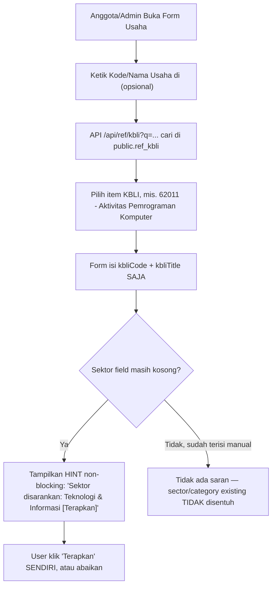

# Arsitektur Integrasi KBLI (Klasifikasi Baku Lapangan Usaha Indonesia)

> **Dokumen Perencanaan Arsitektur Sistem**
> **Status:** Draft direvisi — **BELUM DIEKSEKUSI**, menunggu keputusan eksplisit user untuk lanjut.
> **Riwayat:** Draft awal (1 Agustus 2026) ditulis agen lain. Diaudit kritis (2 Agustus 2026) —
> ditemukan 2 kesalahan fondasional yang, jika dieksekusi apa adanya, akan merusak data usaha
> yang sudah ada secara diam-diam (bukan crash yang gampang ketahuan). Dokumen ini sudah
> direvisi untuk mengoreksi temuan itu — bagian yang salah TIDAK dipertahankan sebagai referensi,
> langsung dikoreksi di tempat, dengan catatan apa yang diubah dan kenapa.
> **Platform:** Jalakarta Multi-Tenant SaaS (`jalajogja`)
> **Target Modul:** Direktori Usaha Anggota (`public.member_businesses`)

---

## 1. Identitas & Tujuan Utama

Dokumen ini mendokumentasikan perencanaan arsitektur integrasi **KBLI (Klasifikasi Baku Lapangan
Usaha Indonesia)** resmi dari BPS Indonesia ke dalam platform Jalakarta, sebagai **field
tambahan murni opsional** — bukan pengganti atau auto-writer untuk taksonomi internal yang
sudah ada.

### Tujuan Utama Integrasi (direvisi):
1. **Kode Legal Resmi Opsional**: Anggota yang butuh kode KBLI resmi (misal untuk urus NIB/OSS)
   bisa mencatatnya di profil usaha mereka — sebagai informasi tambahan, bukan syarat wajib.
2. **Saran Non-Destruktif**: Saat kode KBLI dipilih, sistem BOLEH menyarankan sektor internal
   yang relevan (dari 10 sektor yang sudah dikunci) — tapi HANYA sebagai saran yang bisa
   diabaikan, tidak pernah menimpa nilai `sector`/`category` yang sudah ada tanpa persetujuan
   eksplisit pengguna.
3. **Badge Kredibilitas Publik**: Halaman detail usaha bisa menampilkan badge "KBLI 62011 —
   Aktivitas Pemrograman Komputer" jika data terisi, sebagai penanda kredibilitas tambahan.

> **Perubahan dari draft awal**: tujuan awal (§16 draft) menyebut "auto-mapping" yang
> otomatis mengisi `sector`/`category` — ini DIHAPUS. Lihat § "Audit Kritis" di bawah untuk
> alasan lengkap.

---

## 2. Analisis Provider Data & Keputusan Arsitektur

### Evaluasi Provider: BPS Resmi vs Third-Party Wrapper (`kbli.co.id`)

| Parameter | Third-Party API (`kbli.co.id`) | Master Table Lokal DB (`public.ref_kbli`) 🏆 |
|---|---|---|
| **Status Hukum** | Swasta Independen (bukan `.go.id`) | Data Publik Resmi BPS Peraturan No. 2/2020 |
| **Kecepatan Access** | Tergantung Jaringan Network & Latency | Ultra Cepat (<5 ms via PostgreSQL Index) |
| **Ketergantungan (Uptime)** | Tinggi (resiko error jika API down/berubah) | 100% Bebas Dependensi Eksternal |
| **Ukuran Data** | Remote API Fetch | Ringan (~1.800 baris kode level-5 ≈ 1–2 MB) |

### 🔒 Keputusan yang TETAP DIPERTAHANKAN dari draft awal:
**Jalakarta akan menggunakan Master Table Ingest Lokal (`public.ref_kbli`)** — data KBLI 2020
disalin sekali ke tabel master PostgreSQL, TIDAK PERNAH memanggil `kbli.co.id` dari production.
Ini satu-satunya keputusan arsitektural besar di draft awal yang sudah tepat dan konsisten
dengan pola SEMUA tabel referensi lain di project ini (`ref_provinces`, `ref_regencies`,
`ref_villages`, `ref_ikpm_cabang`, `ref_professions` — semuanya lokal, tidak ada yang live-fetch
API eksternal di runtime).

**Koreksi kecil terhadap draft awal**: `ref_kbli` **harus di `public` schema** (bukan
diasumsikan tenant-scoped di manapun) — konsisten dengan seluruh tabel referensi lain, dan
konsisten dengan lokasi `public.member_businesses` (lihat § "Audit Kritis" poin 1).

---

## 3. Audit Kritis (2026-08-02) — Temuan & Koreksi

Sebelum draft awal dieksekusi, dilakukan verifikasi terhadap kode sungguhan (bukan cuma
membaca dokumennya). Ditemukan 2 kesalahan fondasional:

### 3a. Salah lokasi skema — melanggar arsitektur single-ID

Draft awal (§4B versi lama) menulis kolom baru harus ditambah di
`packages/db/src/schema/tenant/shop.ts`, dan menyebutnya `tenant_{slug}.member_businesses`.

**Fakta sesungguhnya**: `member_businesses` ada di
`packages/db/src/schema/public/member-businesses.ts` — **tabel `public` schema**, bukan
per-tenant. `tenant/shop.ts` isinya `products`/`orders`/`product_categories` (modul Toko),
tidak ada `member_businesses` di sana sama sekali. Ini konsisten dengan prinsip arsitektur yang
sudah dikunci sejak awal project: *"Member data: terpusat di `public.members` — bukan di
tenant schema"* — data usaha anggota adalah data GLOBAL milik orangnya, bukan milik tenant
tempat dia sedang login. `create-tenant-schema.ts` cuma mereferensikannya via FK cross-schema
(`REFERENCES public.member_businesses(id)`), bukti tambahan tabel aslinya di public.

**Dampak kalau tidak dikoreksi**: developer akan mengedit file yang salah, atau menyangka perlu
membuat tabel duplikat per-tenant — dua-duanya salah dan bertentangan langsung dengan prinsip
project.

### 3b. Auto-fill `category`/`sector` — silent data corruption, bukan crash

Ini temuan paling berbahaya. Dicek langsung isi kolom sungguhan di
`packages/db/src/schema/public/member-businesses.ts`:

- **`category`** BUKAN "kategori industri KBLI". Enum-nya
  `["Jasa", "Produsen", "Distributor", "Trading", "Profesional"]` — artinya struktur/peran
  badan usaha. Draft awal mengusulkan auto-fill `category = "Informasi dan Komunikasi"` (nama
  kategori KBLI huruf J) — domain semantik yang sama sekali berbeda, ditulis ke kolom yang
  salah maknanya total.
- **`sector`** sudah punya 10 nilai closed enum (`BUSINESS_SECTOR_ENUM`,
  `apps/web/lib/business-sectors.ts`, dikunci via migration `0055`, 2026-07-30). Draft awal
  mengusulkan `friendlySector` versi BARU dengan 21 nilai (`"Energi & Sumber Daya"`,
  `"Jasa Lingkungan"`, `"Lembaga Publik"`, dst) — **tidak satu pun dari 21 nilai itu cocok**
  dengan 10 nilai `BUSINESS_SECTOR_ENUM` yang sudah ada.
- **Kenapa ini berbahaya, bukan sekadar tidak rapi**: kolom `sector`/`category` **tidak punya
  CHECK constraint di database** (dikonfirmasi dari komentar migration `0055`: *"Kolom TEXT
  biasa TANPA CHECK constraint"*). Menulis nilai di luar 10 enum TIDAK akan crash — PostgreSQL
  terima begitu saja. Setiap tempat yang mengasumsikan closed-enum
  (`getPrioritizedBusinessFields()`, filter dropdown `/usaha`, cast `as BusinessSector` di
  TypeScript) akan diam-diam menerima data rusak tanpa warning apa pun. Ini persis kelas bug
  yang project ini sengaja hindari — `normalizeBusinessSector()` yang sudah ada sengaja
  mengembalikan `null` untuk nilai ambigu (bukan menebak), justru untuk mencegah hal ini.

**Koreksi**: `kbliCode` TIDAK PERNAH auto-write ke `sector` maupun `category`. Kalau ada
"saran sektor", itu HARUS berupa UI terpisah yang pengguna klik untuk menerapkan (lihat § 6),
dan targetnya HARUS salah satu dari 10 nilai `BUSINESS_SECTOR_ENUM` yang sudah ada — bukan
taksonomi baru.

### 3c. Taksonomi keempat — mengulang pola yang sudah pernah ditolak

Saat ini sudah ada **3 lapis klasifikasi usaha** yang sengaja dipisah tapi saling melengkapi:
`sector` (10 nilai, industri), `businessFields` (tag bebas, facet independen, kurasi di
`lib/business-fields.ts`), `offeredTags`/`neededTags` (matching Ekosistem, dari
`lib/ecosystem-tags.ts`). Menambah `kbliCode` + `friendlySector` baru (21 kategori paralel,
bukan reuse 10 yang ada) akan jadi taksonomi **keempat** yang tumpang tindih tujuan dengan
`sector`. Ini persis pola yang di sesi lain pernah diusulkan agen lain untuk modul Ekosistem,
dan ditolak eksplisit oleh user dengan alasan yang sama (dicatat sebagai kritik di
`docs/arsitektur-ekosistem.md` § 3: *"lib/ecosystem-tags.ts akan jadi taksonomi KETIGA yang
tumpang tindih"*).

**Koreksi**: kalau mau ada pemetaan KBLI → sektor, target-nya WAJIB 10 nilai
`BUSINESS_SECTOR_ENUM` yang sudah dikunci — bukan daftar baru. Lihat tabel pemetaan di § 4.

### 3d. Migrasi otomatis data lama — dihapus dari rencana

Draft awal (§7 Fase 4 versi lama) mengusulkan *"script migrasi otomatis untuk memetakan data
usaha lama... ke Kategori KBLI yang sesuai."* Ini berbahaya kalau dieksekusi: memetakan teks
bebas (`businessFields`/`sector` lama) ke 1 dari ~1.800 kode KBLI 5-digit tidak bisa dilakukan
otomatis tanpa fuzzy-matching yang rawan salah. Kalau kode KBLI nanti dipakai untuk keperluan
administratif (badge resmi, klaim "sesuai standar BPS"), kode yang salah bukan cuma bug UX —
itu klaim yang salah secara faktual atas nama usaha orang lain.

**Koreksi**: `kbliCode` untuk SEMUA data existing dibiarkan `NULL` selamanya. Diisi manual,
opsional, oleh pemilik usaha sendiri kalau mereka mau — tidak pernah ditebak sistem.

### 3e. Yang sudah benar dari draft awal (diakui, bukan basa-basi)

- **Master table lokal** (§2) — solid, dipertahankan.
- **Pola API route** (`db + refX` dari barrel package, tanpa `?slug=` karena data genuinely
  global) — dikonfirmasi cocok dengan pola `/api/ref/professions/route.ts` yang sudah ada.
  2 gap kecil untuk diperbaiki: tidak ada `revalidate` cache header (padahal
  `/api/ref/professions` pakai `revalidate = 86400` — data KBLI juga nyaris tidak pernah
  berubah), dan `ilike(refKbli.name, '%${q}%')` rawan karakter `%`/`_` disalahartikan wildcard
  SQL kalau user ketik itu literal — bug kelas ini SUDAH PERNAH terjadi persis di project ini
  (`lookup-member`, sebelum difix), jadi risikonya bukan teori.

---

## 4. Hirarki KBLI & Pemetaan ke 10 Sektor yang Sudah Ada

KBLI punya 5 tingkat hierarki (Kategori 1-huruf → Golongan Pokok 2-digit → Golongan 3-digit →
Subgolongan 4-digit → Kelompok 5-digit). Untuk kebutuhan platform ini, hanya level **Kategori**
(1 huruf, A–U) dan **Kelompok** (kode 5-digit resmi, dipakai OSS) yang relevan disimpan —
3 level tengah tidak perlu tabel terpisah, cukup didenormalisasi sebagai `categoryCode`/
`categoryName` di tiap baris kode 5-digit (lihat § 5).

### Pemetaan 21 Kategori KBLI → 10 Sektor Jalakarta (bukan taksonomi baru)

Ini menjawab langsung pertanyaan "apakah 10 sektor kita sudah cukup lengkap dibanding KBLI?" —
jawabannya sudah dijawab di percakapan sebelumnya dan didokumentasikan di sini sebagai referensi
permanen:

| Kode KBLI | Kategori Resmi BPS | Sektor Jalakarta (existing, `BUSINESS_SECTOR_ENUM`) | Catatan |
|:---:|:---|:---|:---|
| A | Pertanian, Kehutanan dan Perikanan | Pertanian, Peternakan & Perikanan | — |
| B | Pertambangan dan Penggalian | Sumber Daya Alam & Energi | — |
| C | Industri Pengolahan (Manufaktur) | Manufaktur & Pengolahan | — |
| D | Pengadaan Listrik, Gas, Uap/Air Panas & Udara | Sumber Daya Alam & Energi | — |
| E | Pengolahan Air, Sampah, Limbah & Remediasi | Sumber Daya Alam & Energi | sub-field "Pengolahan Limbah & Daur Ulang" sudah ada |
| F | Konstruksi | Logistik, Transportasi & Konstruksi | — |
| G | Perdagangan Besar & Eceran; Reparasi Mobil/Motor | **Split** — lihat catatan | Perdagangan umum → Perdagangan/Ritel/F&B; reparasi kendaraan → Logistik/Transportasi/Konstruksi (sub-field "Bengkel Mobil"/"Bengkel Motor") |
| H | Pengangkutan dan Pergudangan (Logistik) | Logistik, Transportasi & Konstruksi | — |
| I | Penyediaan Akomodasi & Makan Minum | Perdagangan, Ritel & F&B (untuk F&B) | Akomodasi/hotel ambigu — bisa juga dianggap bagian ekosistem pariwisata bersama Travel (sektor Logistik/Transportasi/Konstruksi). Tidak ada sektor "Pariwisata/Perhotelan" tersendiri saat ini. |
| J | Informasi dan Komunikasi | Teknologi & Informasi | — |
| K | Aktivitas Keuangan dan Asuransi | Jasa Usaha & Keuangan | — |
| L | Real Estat | Logistik, Transportasi & Konstruksi | sub-field "Properti & Sewa Lahan" sudah ada |
| M | Aktivitas Profesional, Ilmiah dan Teknis | Jasa Usaha & Keuangan | Konsultasi Legal, Konsultan Manajemen & SDM, dst |
| N | Penyewaan, Ketenagakerjaan & Agen Perjalanan | **Split** — lihat catatan | Agen perjalanan → Logistik/Transportasi/Konstruksi (Travel); penyewaan alat & jasa ketenagakerjaan → tidak ada rumah spesifik, fallback ke Jasa Usaha & Keuangan |
| O | Administrasi Pemerintahan | **Tidak dipetakan** | Tidak relevan — member business tidak pernah berupa lembaga pemerintah |
| P | Pendidikan | Pendidikan & Pelatihan | — |
| Q | Aktivitas Kesehatan Manusia & Aktivitas Sosial | Kesehatan, Farmasi & Herbal | — |
| R | Kesenian, Hiburan dan Rekreasi | Kreatif | — |
| **S** | **Aktivitas Jasa Lainnya** | **⚠️ GAP — tidak ada rumah jelas** | Salon, laundry, reparasi barang pribadi. Belum ada sub-field yang cocok di sektor manapun. Kandidat: tambah sub-field baru di "Jasa Usaha & Keuangan", atau biarkan masuk `businessFields` bebas tanpa sektor spesifik. **Belum diputuskan** — di luar scope integrasi KBLI ini, dicatat sebagai technical debt terpisah. |
| T | Aktivitas Rumah Tangga Sebagai Pemberi Kerja | **Tidak dipetakan** | Tidak relevan — kategori statistik untuk rumah tangga yang mempekerjakan ART, bukan "usaha" dalam pengertian platform ini |
| U | Aktivitas Badan Internasional | **Tidak dipetakan** | Tidak relevan — lembaga internasional (PBB, dst), bukan target pengguna platform |

**Kesimpulan pemetaan**: 18 dari 21 kategori KBLI tercakup wajar (2 di antaranya perlu split
karena mencampur 2 domain sekaligus), 3 kategori (O/T/U) sengaja tidak dipetakan karena memang
tidak relevan untuk konteks usaha anggota IKPM — bukan kelalaian. Satu gap nyata (kategori S)
dicatat terbuka, tidak mendesak, dan **tidak menghalangi** integrasi KBLI berjalan (kbliCode
tetap bisa disimpan meski sektor-nya tidak ada saran otomatis untuk kasus S).

---

## 5. Skema Database (Koreksi Lokasi)

### A. Tabel Master KBLI Global (`public.ref_kbli`)

```typescript
// packages/db/src/schema/public/ref-kbli.ts
import { pgTable, varchar, text, index } from "drizzle-orm/pg-core";

export const refKbli = pgTable(
  "ref_kbli",
  {
    code:           varchar("code", { length: 5 }).primaryKey(), // Kode 5-digit e.g. "62011"
    name:           varchar("name", { length: 255 }).notNull(),  // Nama Indonesia e.g. "Aktivitas Pemrograman Komputer"
    categoryCode:   varchar("category_code", { length: 1 }).notNull(), // e.g. "J" — denormalisasi, bukan tabel hierarki terpisah
    categoryName:   varchar("category_name", { length: 255 }).notNull(), // e.g. "Informasi dan Komunikasi"
    description:    text("description"), // Deskripsi cakupan (opsional, kalau sumber datanya ada)
  },
  (table) => [
    index("idx_ref_kbli_code").on(table.code),
    index("idx_ref_kbli_name").on(table.name),
    index("idx_ref_kbli_category").on(table.categoryCode),
  ]
);

export type RefKbli = typeof refKbli.$inferSelect;
```

> Field `nameEn`/`friendlySector` dari draft awal DIHAPUS — `friendlySector` khususnya, karena
> itulah sumber taksonomi-keempat yang dikoreksi di § 3c. Kalau butuh "sektor yang disarankan",
> itu dihitung on-the-fly dari `categoryCode` via tabel pemetaan statis di § 4 (kode di
> `apps/web/lib/`, bukan kolom DB) — supaya kalau pemetaannya perlu direvisi nanti, cukup ubah
> satu file TypeScript, tidak perlu migration ke 1.800 baris data.

### B. Kolom Tambahan di `public.member_businesses` (koreksi lokasi dari draft awal)

```typescript
// packages/db/src/schema/public/member-businesses.ts — TAMBAHAN, bukan file tenant/shop.ts
export const memberBusinesses = pgTable("member_businesses", {
  // ... kolom existing (id, memberId, name, category, sector, businessFields, dst) ...

  // ── Kode KBLI resmi (opsional) — TIDAK PERNAH auto-fill sector/category ─────────────────
  kbliCode:  varchar("kbli_code", { length: 5 }),   // NULLABLE, tanpa FK — snapshot, konsisten
                                                     // pola coverUrl/logoUrl (URL bukan FK) yang
                                                     // sudah ada di tabel ini
  kbliTitle: text("kbli_title"),                    // Snapshot nama KBLI saat dipilih — supaya
                                                     // tampilan badge tidak perlu JOIN tiap request
                                                     // dan tidak rusak kalau ref_kbli diedit/dihapus
});
```

**Kenapa tanpa FK constraint ke `ref_kbli.code`**: konsisten dengan pola `coverUrl`/`logoUrl`
yang sudah dipakai di tabel yang sama (disimpan sebagai nilai lepas, bukan relasi keras) —
menghindari coupling yang bisa merusak data usaha kalau suatu saat tabel referensi KBLI perlu
di-refresh/direvisi (mis. update tahunan BPS), dan `kbliTitle` sebagai snapshot memastikan badge
tetap tampil benar meski baris `ref_kbli` sumbernya berubah.

---

## 6. Alur Kerja Aplikasi (Revisi — Non-Destruktif)

### Alur A: Pendaftaran / Edit Usaha Anggota (Wizard Step 4 & Admin Edit)



**Perbedaan krusial dari draft awal**: `sector`/`category` TIDAK PERNAH ditulis otomatis oleh
sistem. Saran sektor (kalau kategori KBLI-nya ada pemetaannya di § 4, dan bukan kasus split/gap)
tampil sebagai UI terpisah yang butuh klik eksplisit dari pengguna — dan HANYA muncul kalau
field `sector` masih kosong (tidak pernah menimpa pilihan manual yang sudah ada).

### Alur B: Penayangan Publik (`/{slug}/usaha`)

Tidak berubah dari draft awal — filter tetap berbasis 10 sektor + `businessFields` yang sudah
ada (bukan `friendlySector` KBLI). Di halaman detail usaha (`/{slug}/usaha/[id]`), badge
tambahan muncul HANYA kalau `kbliCode` terisi:
`KBLI 62011 — Aktivitas Pemrograman Komputer`.

---

## 7. Inventaris Komponen & File

```
packages/db/
├── src/schema/public/ref-kbli.ts    ← Schema Master KBLI (baru)
└── migrations/00XX_ref_kbli.sql     ← Seed via INSERT inline, pola SAMA dengan
                                        0019_ref_ikpm_cabang.sql (136 baris di-inline langsung
                                        di migration file) — BUKAN folder src/seed/ baru, karena
                                        project ini TIDAK PERNAH punya pola TypeScript seeder
                                        script terpisah di manapun (dikonfirmasi: grep src/seed
                                        di seluruh packages/db = nol hasil).

apps/web/
├── app/api/ref/kbli/route.ts         ← GET ?q=&limit=20 Autocomplete
├── lib/kbli-sector-suggestion.ts     ← Pemetaan statis § 4 (KBLI category → 10 sektor), pure
│                                        function, bukan kolom DB
└── components/ui/kbli-select.tsx     ← Combobox Autocomplete KBLI
```

### Implementasi API Route (revisi — cache + sanitasi wildcard)

```typescript
// apps/web/app/api/ref/kbli/route.ts
export const dynamic = "force-dynamic";
export const revalidate = 86400; // 24 jam — data KBLI nyaris tidak pernah berubah, sama pola /api/ref/professions

import { NextResponse } from "next/server";
import { db, refKbli }  from "@jalajogja/db";
import { ilike, or }    from "drizzle-orm";

// Escape wildcard LIKE — cegah user input "%"/"_" disalahartikan sebagai wildcard SQL.
// Bug kelas ini sudah pernah terjadi persis di project ini (lookup-member) sebelum difix.
function escapeLike(s: string): string {
  return s.replace(/[\\%_]/g, (c) => `\\${c}`);
}

export async function GET(request: Request) {
  const { searchParams } = new URL(request.url);
  const q = searchParams.get("q")?.trim();
  const limit = Math.min(Number(searchParams.get("limit") ?? 20), 50);

  if (!q || q.length < 2) return NextResponse.json({ items: [] });

  const isNumeric = /^\d+$/.test(q);
  const safeQ = escapeLike(q);

  const items = await db
    .select({
      code: refKbli.code, name: refKbli.name,
      categoryCode: refKbli.categoryCode, categoryName: refKbli.categoryName,
    })
    .from(refKbli)
    .where(isNumeric ? ilike(refKbli.code, `${safeQ}%`) : ilike(refKbli.name, `%${safeQ}%`))
    .limit(limit);

  return NextResponse.json({ items });
}
```

---

## 8. Rencana Tahapan Implementasi (Revisi)

### Fase 1: Database & Seeding (Public Schema)
- [ ] Buat `packages/db/src/schema/public/ref-kbli.ts`, export di `schema/public/index.ts`.
- [ ] Buat migration `00XX_ref_kbli.sql` — `INSERT` inline langsung di file migration (pola
      `0019_ref_ikpm_cabang.sql`), bukan seeder script terpisah.
- [ ] Jalankan migration di lokal + staging.

### Fase 2: Kolom Tambahan & API Route
- [ ] Tambah `kbliCode`/`kbliTitle` (nullable, TANPA FK) ke
      `packages/db/src/schema/public/member-businesses.ts`.
- [ ] Migration `ALTER TABLE public.member_businesses ADD COLUMN ...` — **satu kali**, public
      schema (BUKAN loop per-tenant seperti pola tenant-schema — tabel ini memang di public).
- [ ] Buat `GET /api/ref/kbli` (dengan cache + sanitasi wildcard, lihat § 7).

### Fase 3: UI Component & Saran Non-Destruktif
- [ ] `components/ui/kbli-select.tsx` — Combobox autocomplete.
- [ ] Integrasi di Member Wizard Step 4 (Usaha) & Form Edit Usaha Admin.
- [ ] `lib/kbli-sector-suggestion.ts` — pemetaan § 4, dipakai untuk hint UI (bukan auto-write).
      Hint HANYA tampil kalau `sector` kosong; tidak tampil untuk kategori split (G/N) atau gap
      (S) karena tidak ada pemetaan tunggal yang jujur untuk itu.

### Fase 4: Display Publik
- [ ] Badge `KBLI {code} — {kbliTitle}` di halaman detail usaha, kondisional (`kbliCode` terisi).
- [ ] **TIDAK ADA** migrasi/tebakan otomatis untuk data existing — `kbliCode` semua record lama
      tetap `NULL` selamanya kecuali pemilik usaha mengisinya sendiri secara sadar.

---

## 9. Kesimpulan & Rekomendasi (Revisi)

Integrasi KBLI dengan pendekatan **master table lokal + field tambahan murni opsional** tetap
punya value nyata untuk anggota yang butuh kode legal resmi (urus NIB/OSS), TANPA risiko
merusak taksonomi internal (`sector`/`category`/`businessFields`/Ekosistem tags) yang sudah
dibangun dan sudah dipakai untuk matching:

1. **Additive murni**: `kbliCode`/`kbliTitle` adalah kolom baru yang nullable, tidak menyentuh
   apa pun yang sudah berjalan.
2. **Nol risiko silent corruption**: karena tidak pernah auto-write ke `sector`/`category`,
   tidak ada jalur untuk data taksonomi yang sudah bersih jadi rusak diam-diam.
3. **10 sektor internal tetap satu-satunya sumber kebenaran** untuk filter/matching — KBLI
   murni jadi lapisan metadata legal opsional di atasnya, bukan pengganti.

**Status keputusan**: dokumen ini SIAP dieksekusi kalau dikonfirmasi, tapi **belum ada
instruksi eksplisit untuk mulai** — sesuai permintaan, tidak ada kode yang disentuh sampai ada
konfirmasi lanjut dari user.
