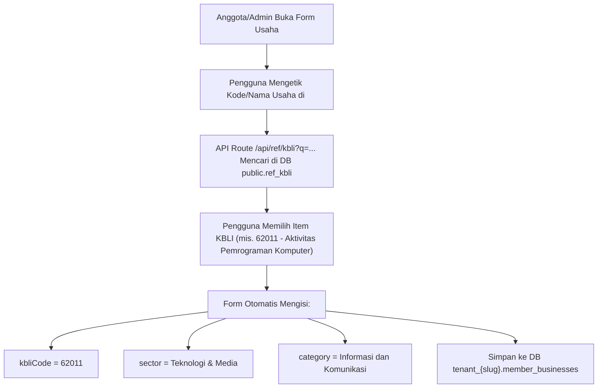

# Arsitektur Integrasi KBLI (Klasifikasi Baku Lapangan Usaha Indonesia)

> **Dokumen Perencanaan Arsitektur Sistem**  
> **Status:** Draft / Proposed  
> **Tanggal:** 1 Agustus 2026  
> **Platform:** Jalakarta Multi-Tenant SaaS (`jalajogja`)  
> **Target Modul:** Direktori Usaha Anggota (`memberBusinesses`)  

---

## 1. Identitas & Tujuan Utama

Dokumen ini mendokumentasikan perencanaan arsitektur integrasi **KBLI (Klasifikasi Baku Lapangan Usaha Indonesia)** resmi dari BPS Indonesia ke dalam platform Jalakarta.

### Tujuan Utama Integrasi:
1. **Standarisasi Klasifikasi Usaha**: Memberikan standar acuan nasional berbasis Peraturan BPS No. 2 Tahun 2020 & OSS RBA bagi seluruh usaha anggota di platform Jalakarta.
2. **Pengisian Otomatis (Auto-Mapping)**: Memudahkan anggota saat mendaftarkan usaha di mana pemilihan Kode KBLI 5-Digit secara otomatis mengisi **Sektor Utama (`sector`)** dan **Kategori Usaha (`category`)**.
3. **Pengalaman Pengguna Ramah (Friendly User Experience)**: Pengunjung publik tetap disajikan pencarian berbasis **Nama Sektor Populer** (mis. *Kuliner, Otomotif, Teknologi*), sementara di latar belakang data tersimpan akurat dengan Kode KBLI 5-digit resmi pemerintah.

---

## 2. Analisis Provider Data & Keputusan Arsitektur

### Evaluasi Provider: BPS Resmi vs Third-Party Wrapper (`kbli.co.id`)

| Parameter | Third-Party API (`kbli.co.id`) | Master Table Lokal DB (`public.ref_kbli`) 🏆 |
|---|---|---|
| **Status Hukum** | Swasta Independen (bukan `.go.id`) | Data Publik Resmi BPS Peraturan No. 2/2020 |
| **Kecepatan Access** | Tergantung Jaringan Network & Latency | Ultra Cepat (<5 ms via PostgreSQL Index) |
| **Ketergantungan (Uptime)** | Tinggi (resiko error jika API down/berubah) | 100% Bebas Dependensi Eksternal |
| **Rate Limit** | Maksimal 30 Request / Menit | Tanpa Batasan (Unlimited Server-Side) |
| **Syarat Lisensi** | Wajib mencantumkan link kredit terbuka `kbli.co.id` | Bebas Watermark / Kredit Eksternal |
| **Ukuran Data** | Remote API Fetch | Sangat Ringan (~1.800 baris data $\approx$ 1,5 MB) |

### 🔒 Keputusan Arsitektur Dikunci (Locked Decision):
**Jalakarta akan menggunakan Opsi B: Master Table Ingest Lokal (`public.ref_kbli`).**  
Data KBLI 2020/2025 disalin (*ingest/seed*) sekali ke dalam tabel master PostgreSQL di `public` schema. Pola ini sama persis dengan pengelolaan data wilayah Indonesia (`public.ref_provinces` & `public.ref_regencies`).

---

## 3. Hirarki KBLI & Pemetaan Sektor Ramah Pengguna (Friendly Mapping)

KBLI memiliki 5 tingkatan piramida klasifikasi:
1. **Kategori** (1 Abjad: A – U) $\rightarrow$ 21 Sektor Utama Resmi BPS.
2. **Golongan Pokok** (2 Digit) $\rightarrow$ Kelompok Industri/Jasa.
3. **Golongan** (3 Digit) $\rightarrow$ Sub-Kelompok Industri.
4. **Subgolongan** (4 Digit) $\rightarrow$ Detail Turunan Produk/Jasa.
5. **Kelompok** (5 Digit) $\rightarrow$ Kode Resmi OSS perizinan usaha komersial riil.

### Tabel Pemetaan Kategori KBLI A-U ke Sektor Populer Jalakarta:

| Kode KBLI | Kategori Resmi BPS | Sektor Populer Jalakarta (`friendlySector`) |
| :---: | :--- | :--- |
| **A** | Pertanian, Kehutanan dan Perikanan | **Pertanian & Perikanan** |
| **B** | Pertambangan dan Penggalian | **Energi & Sumber Daya** |
| **C** | Industri Pengolahan (Manufaktur) | **Manufaktur & Olahan** |
| **D** | Pengadaan Listrik, Gas, Uap/Air Panas & Udara | **Energi & Sumber Daya** |
| **E** | Pengolahan Air, Sampah, Limbah & Remediasi | **Jasa Lingkungan** |
| **F** | Konstruksi | **Konstruksi & Properti** |
| **G** | Perdagangan Besar & Eceran; Reparasi Mobil/Motor | **Perdagangan & Otomotif** |
| **H** | Pengangkutan dan Pergudangan (Logistik) | **Logistik & Transportasi** |
| **I** | Penyediaan Akomodasi & Makan Minum | **Kuliner & Akomodasi** |
| **J** | Informasi dan Komunikasi | **Teknologi & Media** |
| **K** | Aktivitas Keuangan dan Asuransi | **Keuangan & Asuransi** |
| **L** | Real Estat | **Konstruksi & Properti** |
| **M** | Aktivitas Profesional, Ilmiah dan Teknis | **Jasa Profesional** |
| **N** | Penyewaan, Ketenagakerjaan & Agen Perjalanan | **Jasa Usaha & Travel** |
| **O** | Administrasi Pemerintahan | **Lembaga Publik** |
| **P** | Pendidikan | **Pendidikan & Pesantren** |
| **Q** | Aktivitas Kesehatan Manusia & Aktivitas Sosial | **Kesehatan & Sosial** |
| **R** | Kesenian, Hiburan dan Rekreasi | **Seni, Hiburan & Rekreasi** |
| **S** | Aktivitas Jasa Lainnya | **Jasa Konsumen & Komunitas** |
| **T** | Aktivitas Rumah Tangga Sebagai Pemberi Kerja | **Jasa Perorangan** |
| **U** | Aktivitas Badan Internasional | **Lembaga Internasional** |

---

## 4. Skema Database

### A. Tabel Master KBLI Global (`public.ref_kbli`)
Ditempatkan di schema `public` agar dapat diakses oleh seluruh tenant secara efisien.

```typescript
// packages/db/src/schema/public/ref-kbli.ts
import { pgTable, varchar, text, index } from "drizzle-orm/pg-core";

export const refKbli = pgTable(
  "ref_kbli",
  {
    code:           varchar("code", { length: 5 }).primaryKey(), // Kode 5-digit e.g. "62011"
    name:           varchar("name", { length: 255 }).notNull(),  // Nama Indonesia e.g. "Aktivitas Pemrograman Komputer"
    nameEn:         varchar("name_en", { length: 255 }),         // Nama Inggris (opsional)
    categoryCode:   varchar("category_code", { length: 1 }).notNull(), // e.g. "J"
    categoryName:   varchar("category_name", { length: 255 }).notNull(), // e.g. "Informasi dan Komunikasi"
    friendlySector: varchar("friendly_sector", { length: 100 }).notNull(), // e.g. "Teknologi & Media"
    description:    text("description"),                         // Deskripsi perizinan / cakupan
  },
  (table) => [
    index("idx_ref_kbli_code").on(table.code),
    index("idx_ref_kbli_name").on(table.name),
    index("idx_ref_kbli_category").on(table.categoryCode),
  ]
);

export type RefKbli = typeof refKbli.$inferSelect;
```

### B. Update Schema Usaha Tenant (`tenant_{slug}.member_businesses`)

Menambahkan kolom `kbli_code` sebagai referensi KBLI 5-digit:

```typescript
// packages/db/src/schema/tenant/shop.ts (memberBusinesses)
export const memberBusinesses = s.table("member_businesses", {
  // ... kolom lama yang sudah ada ...
  kbliCode: varchar("kbli_code", { length: 5 }), // NULLABLE — Referensi Kode KBLI 5-Digit
});
```

---

## 5. Alur Kerja Aplikasi (Application Workflows)

### Alur A: Pendaftaran / Edit Usaha Anggota (Wizard Step 4 & Admin Edit)


### Alur B: Penayangan & Filter Publik (`/{slug}/usaha`)
1. **Halaman Direktori Usaha (`/{slug}/usaha`)**:
   - Filter Tab/Dropdown menampilkan pilihan **Friendly Sector** (*Kuliner, Otomotif, Teknologi, Jasa, dll.*).
   - Pengunjung juga bisa mencari spesifik berdasarkan Kata Kunci atau Kode KBLI di bar pencarian.
2. **Halaman Single Detail Usaha (`/{slug}/usaha/[id]`)**:
   - Di card Informasi Usaha, jika `kbliCode` terisi, tampilkan badge resmi KBLI:  
     `KBLI 62011 - Aktivitas Pemrograman Komputer`.

---

## 6. Inventaris Komponen & File Yang Ditambahkan

```
packages/db/
├── src/
│   ├── schema/public/ref-kbli.ts    ← Schema Master KBLI
│   └── seed/kbli-seeder.ts           ← Seeder Ingest 1.800+ Kode KBLI BPS

apps/web/
├── app/
│   └── api/
│       └── ref/
│           └── kbli/
│               └── route.ts          ← GET ?q=&limit=20 Autocomplete Endpoint
├── components/
│   └── ui/
│       └── kbli-select.tsx           ← Combobox Autocomplete KBLI Component
```

### Implementasi API Route Autocomplete:
`apps/web/app/api/ref/kbli/route.ts`

```typescript
import { NextResponse } from "next/server";
import { db, refKbli }  from "@jalajogja/db";
import { ilike, or, eq } from "drizzle-orm";

export async function GET(request: Request) {
  const { searchParams } = new URL(request.url);
  const q = searchParams.get("q")?.trim();
  const limit = Math.min(Number(searchParams.get("limit") ?? 20), 50);

  if (!q || q.length < 2) {
    return NextResponse.json({ items: [] });
  }

  // Jika query berupa angka (mis. "62" atau "62011")
  const isNumeric = /^\d+$/.test(q);

  const items = await db
    .select({
      code:           refKbli.code,
      name:           refKbli.name,
      categoryCode:   refKbli.categoryCode,
      categoryName:   refKbli.categoryName,
      friendlySector: refKbli.friendlySector,
    })
    .from(refKbli)
    .where(
      isNumeric
        ? ilike(refKbli.code, `${q}%`)
        : or(
            ilike(refKbli.name, `%${q}%`),
            ilike(refKbli.friendlySector, `%${q}%`)
          )
    )
    .limit(limit);

  return NextResponse.json({ items });
}
```

---

## 7. Rencana Tahapan Implementasi (Implementation Plan)

### Fase 1: Database & Seeding (Public Schema)
- [ ] Buat file schema `packages/db/src/schema/public/ref-kbli.ts`.
- [ ] Export schema di `packages/db/src/schema/public/index.ts`.
- [ ] Buat file dataset seeder `packages/db/src/seed/kbli-seeder.ts` berbasis JSON KBLI 2020 BPS resmi.
- [ ] Jalankan seeder ke database PostgreSQL lokal & staging.

### Fase 2: Schema Migration & API Route
- [ ] Tambahkan kolom `kbliCode` pada `memberBusinesses` di `packages/db/src/schema/tenant/shop.ts`.
- [ ] Buat API Route `GET /api/ref/kbli` untuk pencarian autocomplete.

### Fase 3: UI Component `<KbliSelect>` & Form Wizard
- [ ] Buat komponen `components/ui/kbli-select.tsx` (Command + Popover autocomplete).
- [ ] Integrasikan `<KbliSelect>` di Member Wizard Step 4 (Usaha) & Form Edit Usaha di Admin Dashboard.
- [ ] Implementasikan fitur auto-fill `sector` & `category` otomatis saat KBLI dipilih.

### Fase 4: Display Front-end Publik & Backward Compatibility
- [ ] Update `UsahaDetailPage` (`/usaha/[id]`) untuk menampilkan badge Kode KBLI 5-Digit di card informasi usaha jika data terisi.
- [ ] Jalankan script migrasi otomatis untuk memetakan data usaha lama yang sudah terdaftar ke Kategori KBLI yang sesuai.

---

## 8. Kesimpulan & Rekomendasi

Integrasi KBLI dengan pendekatan **Master Table Ingest Lokal (`public.ref_kbli`)** memberikan solusi sempurna bagi platform Jalakarta:
1. **Ultra Cepat & Handal**: Tidak bergantung pada API server luar.
2. **Dual Layering**: Memungkinkan pengisian data legal presisi (KBLI 5-digit) tanpa mengorbankan kenyamanan pengunjung publik (Sektor Populer).
3. **Penyelarasan Multi-Tenant**: Siap digunakan oleh semua tenant Jalakarta secara terpusat dan efisien.
